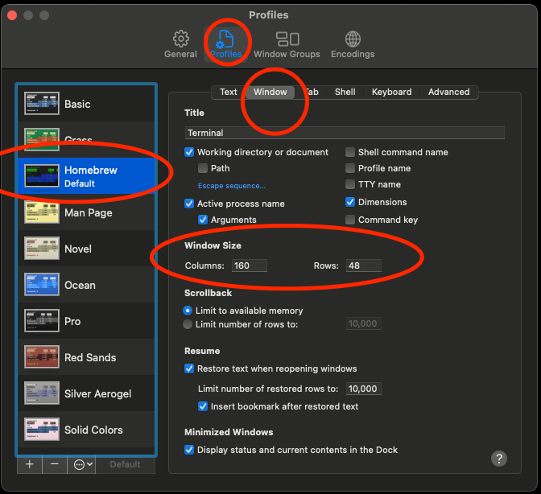

# Getting started

## Setting up your terminal on a Mac

- Open up the terminal app (⌘ + space bar) then type terminal and hit return
- Once terminal opens go to the terminal menu and select preferences
- On the profiles tab select a color scheme that works well for you (I like homebrew)
- You can also modify the default terminal window size on the profiles/window tab (I like to set to 160x48)

## Installing git

Once you have your terminal set up in a style/format that you find useable you'll want to install git.  From the terminal simply type `git` and your Mac should prompt you to install the xcode command line developer tools.  Follow the prompts to install.

## Oh-my-zsh

To make the command line more friendly I recommend installing <a href="https://ohmyz.sh/#install">oh-my-zsh</a> which will add a number of customizations to the command line and change your default shell from the system default of bash to zsh.  That doesn't need to make sense today, just know that it will make the prompt much more friendly.

Copy and paste the following command into the terminal and hit return:

    sh -c "$(curl -fsSL https://raw.github.com/ohmyzsh/ohmyzsh/master/tools/install.sh)"

## homebrew

<a href="https://brew.sh">Homebrew</a> is a package manager for Mac OS that will allow you to install a number of utilities/applications on your Mac from the command line.

Copy and paste the following command into the terminal and hit return:

    /bin/bash -c "$(curl -fsSL https://raw.githubusercontent.com/Homebrew/install/HEAD/install.sh)"

## SDK Man

<a href="https://sdkman.io">SDK Man!</a> is currently the best way to install and managed different programming languages on your computer.  

Copy and paste the following command inot the terminal and hit return:

    curl -s "https://get.sdkman.io" | bash

## Installing the JDK

Once this is installed you will want to install the JDK (Java Development Kit).  The JDK is used to build and run applications written in a number of languages including Java, Kotlin, and Groovy

    sdk update
    sdk list java | grep zulu | grep -v fx

You should see a list of java candidates from the zulu family of jdk's.  Pick a 17 version and run the following command.  If the version used below is not in the list, just pick the next 17.x.x version you do find and replace it in the command.

    sdk install java 17.0.5-zulu

## Micronaut CLI

Micronaut is a very powerful programming framework for JDK based languages and will be used for programming examples I will share here.

    sdk install micronaut

## Visual Studio Code

Microsoft has created a very powerful cross-platform editor called <a href="https://code.visualstudio.com">Visual Studio Code</a>.  This can be used a full fledged Integrated Development Environment (IDE) or just a handy text editor.  It's great to have on hand as you move forward with learning to code.

## IntelliJ IDEA Community Edition

<a href="https://www.jetbrains.com/idea/download/#section=mac">IntelliJ Community Edition</a> is an extremely full featured Integrated Development Environment that works very well with all the JDK based languages.

## Lessons

Check back later for lessons that I will post here.
