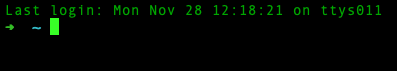
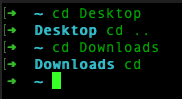

# Lesson 1 - The command line

The command line is an indispensible tool for any power user of a computer.  The examples below will assume that you've followed the initial setup instructions in this repository and that your Mac Terminal should now be running the <a href="https://en.wikipedia.org/wiki/Z_shell">zshell</a> with <a href="https://ohmyz.sh/#install">oh-my-zsh</a> providing some customizations on top of zshell.  

The easiest two ways to launch the terminal on a Mac are:
- Press (⌘ + space bar) to bring up Spotlight Search and then type `terminal` and hit return
- Or once terminal is up and running go to the dock at the bottom of the screen and click/drag the terminal to the left side of the dock.  This will pin the terminal icon there so you can click it anytime you want to bring up the terminal.

When you launch a new terminal you should see something like this:

## Changing Directories

Your computer has a filesystem that is organized in a structure called directories.  GUI (Graphical User Interface) tools like Finder tend to show us these directories as folders.  A directory can be empty or contain one or more files or directories.  To move around these directories we use the change directory command which is abbreviated as `cd`.

When you first open your terminal you should be in your home directory which is denoted by a tilda `~` symbol.

Use the following commands in the terminal to change directories:

    cd Desktop
    cd ..
    cd Downloads
    cd

When you cd to Desktop you'll notice your terminal's command prompt changes from a tilda to saying `Desktop`.  `cd ..` is a shorthand for saying go back up one directory which in this case puts you back in your home directory.   Then `cd Downloads` takes you into your downloads directory.  And `cd` without anything after it is another shorthand that means change directory back to my home directory.

## Creating Directories

Let's install a fun utility called tree

    brew install tree

Then let's create a few directories and a file

    cd
    mkdir -p source/lesson-01
    mkdir -p source/foo/bar/baz
    touch source/foo/bar/hello-world.txt
    cd source

Then run the `tree` command:

    tree

You should see something like this:

	  .
		├── foo
		│ └── bar
		│     ├── baz
		│     └── hello-world.txt
		└── lesson-01

What did we do?  The `cd` command by itself took us to our home directory.  

`mkdir -p source/lesson-01` did two things.  First it created the source directory, and then it created a lesson-01 directory inside of the source directory.

The second `mkdir` command created the foo/bar/baz folders under source.  The `touch` command created a file named `hello-world.txt` under the bar folder.

Finally, `cd source` took us into the source directory.

The `tree` command printed out the whole directory structure including files under the current directory.  If you ran `tree` from your home directory it would print off many more things.

The `mkdir` command is short for make directory.  You can create directories one at a time such as `mkdir foo` or you can create a whole path by specifying `-p`.  When you use `-p` it will create every directory in the given path if it doesn't already exist.  You can also create directories inside another directory by running `mkdir foo/bar`.  If the directory foo doesn't exist this will throw an error.  If foo does exist then the directory bar will be created under foo.

## Deleting

Ok, we don't need those extra directories or that hello-world.txt file so let's delete them and use our tree command to see how each command below has modified our directories and files.

    cd ~/source
    tree
    rm foo/bar/hello-world.txt
    tree
    rmdir foo/bar/baz
    tree
    rmdir -p foo/bar
    tree
   
`cd ~/source` is yet another short hand that says take me to the source directory that is under my home directory.

`rm` is a command that is used on files whereas `rmdir` is used on directories.  There is a way to completely remove all files and folders using the `rm` command but it can be very dangerous if you use it in the wrong place so let's stick to safe uses for now.

## echo and cat

Let's go into our lesson-01 directory and play with the echo and cat commands.

    cd ~/source/lesson-01
    echo hello world
    echo hello world > hello-world.txt
    ls
    cat hello-world.txt

What's happening here?  `cd ~/source/lesson-01` is taking us into our lesson-01 directory we created earlier.  echo is a command that simply echoes whatever comes after it.  The first echo call just echoes hello world back into the terminal where we can see it.  The second echo call with the `>` following it is redirecting the output of echo into a file named hello-world.txt in the current directory.  It's ok that hello-world.txt didn't exist here before this.  The command caused it to be created.

`ls` is the list command.  It will list the contents of the current directory by default.  Or if you specify the path to another directory will show us the contents there.  We will play with the ls command more later on.  It should've showed you that there is a new file named hello-world.txt in the current directory.

Finally `cat` is a command line utility to concatenate and print files.  In this case we're using it to simply show us the contents of our hello-world.txt file.

Let's try a few more commands:

    echo hello > hello-world.txt
    cat hello-world.txt

What happened?  Previously our file had `hello world` in it but now it just says `hello`.  When we use `>` to write to a file we tell the system to truncate and replace the contents with something new.  In this case just the word `hello`.

    echo world >> hello-world.txt
    cat hello-world.txt

What happened?  By using `>>` instead of `>` we told the system to append our new output to the file.  So now we have a second line that says `world`.

## pwd

The oh-my-zsh settings we're using give us the current directory's name in our prompt.  But, sometimes we need to know the full path to where we are.  We're going to use the `pwd` command to find out where we are.

		pwd

What happened?  You should see something like `/Users/<some name>/source/lesson-01`.  The `/` at the start of that string tells us this a reference from the root of the file system.  On a Mac everything has some path from `/`.  The `/Users/<some name>` is yet another way of describing your home directory.

## man

Before the internet existed users had to rely on documentation either in printed format or in manual pages on their computer.  For many commands you can type `man <command name>` and get a manual page in the terminal.

Let's take a look at the man page for the man command:

	  man man

You'll see a description of the man command, different possible command line options you could use with it, and some examples.  You can use the arrow keys to move up/down the page one line at a time.  Hitting the space bar will jump a whole screen at a time.  If your keyboard has the page up/page down keys you can also use those to move through the text.  And, finally hit `q` to quit.

Go ahead and try the man command on some of the other commands we've tried above:

    man ls
    man cd
    man mkdir
    man rmdir
    man rm
    man cat
    man echo
    man tree
    man brew

Anytime you come across a new command feel free to try using the man command to look at how it can be used.

## clear

Sometimes the our terminal becomes cluttered and we just want a blank screen.  Use the `clear` command to clear the current terminal.

## pbcopy and pbpaste

Mac has a handy set of utilities for working with the clipboard.  Let's open Text Edit.  Press (⌘ + space bar) to bring up Spotlight Search and then type `Text Edit` and hit return.

In the terminal run the following command:

    echo hello world | pbcopy

Then switch to your text edit window, click the cursor in the window and hit (⌘ + v) to paste.  The hello world that we echoed on the command lined was "piped" into the pbcopy command which put our hello world into the clipboard.

In our text edit window change the text to "see you later" and then select all (⌘ + a) and copy (⌘ + c).  Then back in our terminal run the following commands:

    pbpaste > file1.txt
    cat file1.txt 

If everything worked correctly pbpaste took the contents of the clipboard and we redirected the output into file1.txt.

The pipe `|` operator allows us to send the output of one command in the terminal into another command.  Whereas the redirect `>` and `>>` operators allow us to send the output of a command to a file.

## open

Another utility specific to Mac which is extremely helpful is the `open` command.  Check out the man page for open `man open`.

Try the command out:

    open .

This should cause Finder to pop open showing you the contents of the current directory.

    open file1.txt

This should cause Text Edit to pop open with our file1.txt file.

    open http://dilbert.com

This will cause Safari to open and bring you to the funniest comic on the interwebs.

Open will try to figure out the right application to open the given resource in.  But, sometimes it gets it wrong.  So when we get into use VS Code and IntelliJ we'll make sure we set up command aliases so we can open things directly in those tools.

## Summary

Go ahead and play around with the commands above.  Get used to seeing how they work.  Feel free to open up Finder and watch how the various commands we used above change files and directories.
