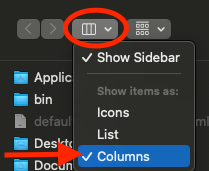
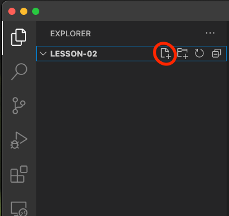
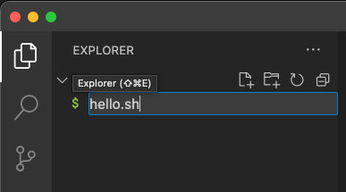

# Lesson 02

For lesson 02 we'll work on some simple shell scripts.  So far we've done some initial setup of your computer and ran some shell commands in the terminal.  A shell script is a collection of commands together in a single file.  When you invoke the shell script file it runs all of the commands in the file.  This is a simple program.

## Getting started

First let's create a home for our lesson:

    cd ~/source
    mkdir lesson-02
    cd lesson-02

As we've learned before this will change our directory to ~/source and then make a directory with the name lesson-02 and then change into that directory.

## Open Visual Studio Code

Let's open Visual Studio Code.  This should have been installed in the initial setup.  (⌘ + space bar) then type `Visual Studio Code` and hit return.  This should open vs code.  Go to the File menu and select `open folder`.  Let's switch the navigation in the dialog to columns.  At the top of the dialog select the drop down indicated in the screen shot below and click on columns.

Look for `source` in the first column of folders.  Click once on source then you should see `lesson-02` in the second column.  Click once on that folder and then click open in the bottom right.  If you get a big dialog that says "Do you trust the authors of the files in this folder?" check the checkbox to "Trust the authors of all files in the parent folder 'source'", and then click "Yes, I trust the authors Trus folder and enable all features".

## Creating our shell script

On the left side of your screen you'll see an explorer.  Lesson-02 should be open and there should be a button with a plus sign on it.  Press this to create a new file.

A box should then open below lesson-02, enter the name `hello.sh` and hit return.  You should now have a new file.

On the right side of VS Code you should now have a tab named `hello.sh` copy and paste the following code into the this tab:

    #!/bin/bash

		echo hello world!

Hit (⌘ + s) to save the file.  

## Making our script executable and running it

While holding the ⌘ key hit tab one or more times until your terminal is selected and then release the ⌘ key.  You should be back in your terminal in your lesson-02 folder.

At the command prompt run the following command:

    ./hello.sh

What happened?  You should've gotten the following error:

    zsh: permission denied: ./hello.sh

Unix shell environments don't let you run just any file.  They have to have what's called the "execute bit" assigned to them.  Run the command:

    ls -alF

You should see something like this:

    drwxr-xr-x  - SOMEUSER 28 Nov 15:40 ./
		drwxr-xr-x  - SOMEUSER 28 Nov 15:35 ../
		.rw-r--r-- 30 SOMEUSER 28 Nov 15:45 hello.sh

The two lines that start with "d" are directories.  The one that starts with a "." is a file.  The string of letters and hyphens afterwards are broken into three groups of three characters.  The first set of three is `rw-` this is the permission you have on your file.  In this case r = read, w = write, - = not executable.  We don't really need to worry about the other two groups of `r--` at the moment.  For us to be able to run our new script we need to add the execute bit to our script.

    chmod +x hello.sh
    ls -alF

What happened?  `chmod` changes file modes, in this case we told it to add the execute bit to our file.

You should now see this:

    .rwxr-xr-x 30 SOMEUSER 28 Nov 15:45 hello.sh*

We now have `x` meaning it is executable and the file ls put an * at the end of the entry.  That tells us this file can be executed.

Let's try it again!

    ./hello.sh

If you've done everything correctly it should now say hello world.

## Accepting input

Let's change our script.  Go back to vs code.  Remember hold ⌘ and hit tab until you are back to vs code and then release the ⌘ key.  Paste the following code into our hello.sh script in vs code.

    #!/bin/bash
    
    echo "Who am I talking to?"
    read name
    
    echo Hello $name

Go back to your terminal and run:

    ./hello.sh

The script should now ask for your name.  Type in a name and hit return.  It will now say hello to whatever name you entered.  Let's break down what this very simple script is doing.

`#!/bin/bash` is called a shebang line.  This tells the shell what program to use to handle the rest of this file.  This only applies to shell scripts.  In this case we told it to use bash, because almost all modern Unix/Linux computers have bash on them so we can consider it a lowest common denominator.

We then echo our question "Who am I talking to?" to the user.  Followed by `read name`.  The read command is part of the shell, we're telling the shell that we want the user to type something and we want to put it into a variable named `name`.  On the next line we say `echo Hello $name`.  Putting a dollar sign in front of a word in shell scripts says I want to use a variable with this name here.  The shell is smart enough to say "I saw a variable with that name up above, let's put the value here."  Variables are placeholders.  We can assign values to them and then use them again later.

## Guessing game

Let's make a guessing game script.  In the terminal run the following commands:

    touch guessing-game.sh
    chmod +x guessing-game.sh

Then go back to vs code and you should see the guessing-game.sh in the explorer on the left side.  Click on it and a new tab should open with your file.  Copy and paste the following code into the tab:

    #!/bin/bash
    
		number=$(( ( RANDOM % 100 )  + 1 ))
    
		echo "I've picked a random number between 1 and 100"
    
		while :
		do
		    read -p "Enter your guess: " guess
		    echo "You guessed $guess"
		    if [ $guess -gt $number ]
		    then
		        echo "Too high!"
		    elif [ $guess -lt $number ]
		    then
		        echo "Too low!"
		    else
		        echo "You're right the number was $number"
		        exit 0
		    fi
		done
    
Save the file and go back to the terminal.  Run the following command:

    ./guessing-game.sh

Go ahead and play the guessing game.  What's going on here?

We won't get into the magic of generating a random number.  That includes some interesting math operations.  But, this example demonstrates two key concepts in programming.  Loops and if statements.

### Loops

Loops are a blocks of code that do something repeatedly.  In our example above we're using a type of loop called a `while` loop.  A while loop keeps doing the thing inside while the expression to the right of it is true.  You'll notice we said `while :` in our example above.  Since we don't have an expression to the right, just a colon, this while loop will keep going until we break out of it or exit.

There are other types of loops that we will explore later as we move into writing code in java and kotlin.

### If statements

If statements allow us to ask a question and do something if that question is true.  In our example above we're using a more complex form of an if statement that has multiple branches.  First we ask `if [ $guess -gt $number ]`.  This is asking if the value of our variable guess is greater than the value of our variable named number.  If the answer to that question is true then we'll do the code that follows the `then`.

We also have an `elif [ $guess -lt $number ]`.  This is asking a second question.  If the answer to the first question was false we'll move down to the `elif` and ask our second question.  In this case was our guess less than our number.  If true, we'll do the code after the `then`.

Finally we have an `else`.  If the first two questions are both false, then we will do what is in the else statement.  If our guess isn't bigger than our number, and it isn't smaller than our number, then it must be the number.  Or is it?  Try running the script again but this time for your answer put in a word like `foo`.  Since we didn't check to see if our guess was a number we get some errors and because of our else statement it will claim we guessed correctly.  Oops.  Keep that in mind for the future, it can be important to check your input to make sure it's correct.

There are other flavors of branching logic that we'll cover later as we get into java and kotlin.  And, every programming language will have it's own syntax for how branching logic is written out and what keywords are involved.

## Summary

We covered a few concepts in this lesson including:
- Creating new shell scripts both by the command line and from our editor
- Using the ls (list) command
- Using the chmod command to set the execution bit on a script to make it runnable
- Making a hello world shell script, and then modifying it to accept input
- Loops and If statements

Shell scripting is just one kind of programming and there are many different kinds of scripting languages available some are specific to the type of computer you are on.  Most software engineers will use scripting languages in their work, but they will use scripting mostly as a tool to support their other work.

If you want to learn more about shell scripting use the search terms `bash scripting tutorial` in a search engine.  There are many very good resources out there.  But, you may need to learn more key concepts first in order to understand many of the examples.